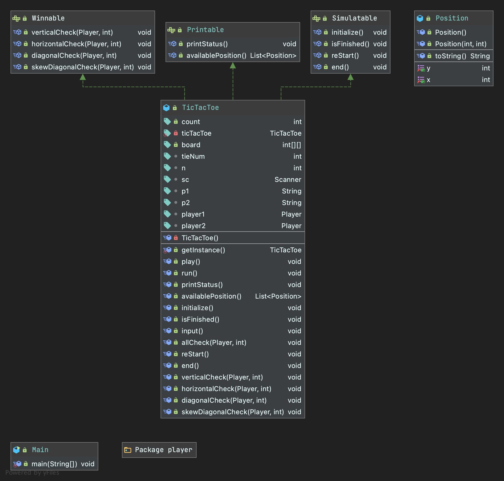
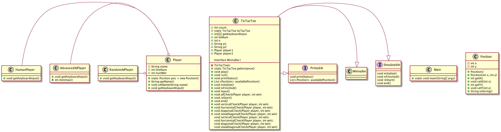

# TicTacToe
## UML
- TicTacToe UML

- Player UML

## PUML

## How to play Game
1. 몇 번 먼저 승리해야 게임이 끝나는지 정한다. (n값 입력)
2. Player 1, 2의 모드를 각각 순서대로 결정한다. (r : random bot, h : human, ai : advanced ai)
3. 좌표를 입력하며 게임을 즐긴다.